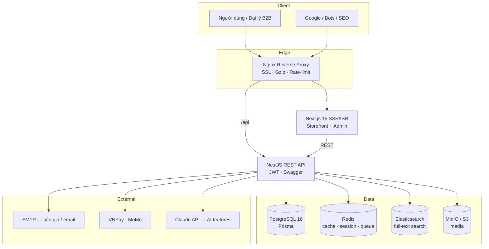

# Kiến trúc hệ thống — TechMart

## 1. Sơ đồ tổng thể

## 2. Thành phần

| Thành phần      | Vai trò |
|-----------------|---------|
| **Nginx**       | Reverse proxy, TLS termination (Let's Encrypt), gzip, rate-limit, route `/` → frontend, `/api` → backend. |
| **Frontend**    | Next.js 15 App Router. SSR cho trang động, ISR cho danh mục/sản phẩm/tin tức (SEO + tốc độ). Cung cấp cả storefront và CMS admin. |
| **Backend**     | NestJS module hóa: Auth, Users, Categories, Brands, Products, Cart, Orders, Quotes, Articles, Search, Upload, Payments, AI, Admin. |
| **PostgreSQL**  | Nguồn dữ liệu chính (source of truth) qua Prisma ORM. |
| **Redis**       | Cache truy vấn, lưu refresh-token blacklist, hàng đợi gửi email báo giá (BullMQ). |
| **Elasticsearch** | Tìm kiếm full-text tiếng Việt, gợi ý, lọc facet. Đồng bộ từ Postgres khi sản phẩm thay đổi. |
| **MinIO**       | Lưu ảnh sản phẩm, banner, file Excel báo giá (S3-compatible, dễ chuyển sang AWS S3). |

## 3. Luồng dữ liệu chính

1. **Đọc sản phẩm**: FE gọi `/api/products` → BE đọc Redis cache → nếu miss thì query Postgres → cache lại.
2. **Tìm kiếm**: FE gọi `/api/search` → BE query Elasticsearch → trả facet + kết quả.
3. **Báo giá nhanh**: User chọn sản phẩm / upload Excel → BE lưu `QuoteRequest` → đẩy job vào Redis queue → worker gửi email cho sales + xác nhận cho khách.
4. **Thanh toán**: Order tạo ở trạng thái `PENDING` → tạo URL VNPay/MoMo → callback IPN cập nhật `PAID`.

## 4. Bảo mật

- JWT access (15m) + refresh (7d, lưu hashed trong DB, có thể thu hồi).
- RBAC: `CUSTOMER`, `DEALER` (B2B), `STAFF`, `ADMIN`.
- Mật khẩu băm bằng `argon2`.
- Rate-limit ở Nginx + `@nestjs/throttler` ở API.
- Validation bằng `class-validator` trên mọi DTO.
- Helmet + CORS whitelist.

## 5. Hiệu năng & Core Web Vitals

- Next.js ISR + streaming → LCP < 2s.
- Ảnh phục vụ qua `next/image` + MinIO, lazy-load → CLS < 0.1.
- Tách bundle, prefetch link, `framer-motion` chỉ tải khi cần → INP < 200ms.
- Redis cache + ES giảm tải DB.

## 6. Khả năng mở rộng

- Backend stateless → scale ngang nhiều replica sau Nginx.
- Elasticsearch & Redis tách cluster riêng khi tải lớn.
- MinIO → AWS S3 chỉ cần đổi biến môi trường.
