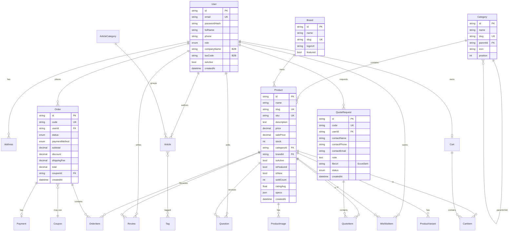

# ERD — TechMart Database

## Bảng chính

| Bảng | Mô tả |
|------|-------|
| **User** | Khách lẻ (B2C), đại lý (B2B), nhân viên, admin. Có `companyName`, `taxCode` cho B2B. |
| **Category** | Danh mục đa cấp (self-relation `parentId`). |
| **Brand** | Thương hiệu (Makita, Bosch, Dewalt...). |
| **Product** | Sản phẩm, `specs` dạng JSON, `salePrice` cho khuyến mãi, cờ `isFeatured/isNew`. |
| **ProductVariant** | Biến thể (màu, công suất, điện áp...). |
| **Cart / CartItem** | Giỏ hàng gắn user. |
| **Order / OrderItem** | Đơn hàng + chi tiết. |
| **Payment** | Giao dịch COD / chuyển khoản / VNPay / MoMo. |
| **Coupon** | Mã giảm giá (%, cố định, theo điều kiện). |
| **QuoteRequest / QuoteItem** | Yêu cầu báo giá B2B (chọn nhiều sản phẩm / upload Excel). |
| **Review / Question** | Đánh giá & hỏi đáp sản phẩm. |
| **WishlistItem** | Danh sách yêu thích. |
| **Article / ArticleCategory / Tag** | Tin tức kỹ thuật + SEO. |
| **Banner / Popup** | Quản lý hiển thị trang chủ. |

Định nghĩa đầy đủ: [`backend/prisma/schema.prisma`](../backend/prisma/schema.prisma).
